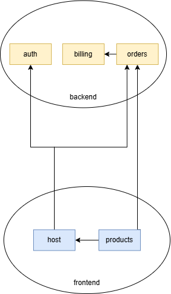
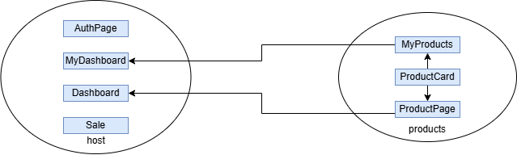

# Service Oriented Architecture

First, clone the git repository :

```jsx
git clone [https://github.com/RonangLeSang/ServiceOrientedProjectFinal.git](https://github.com/RonangLeSang/ServiceOrientedProjectFinal.git)
```

then build the docker :

```jsx
docker-compose up --build -V
```

## Project structure

global architecture :



frontend architecture

